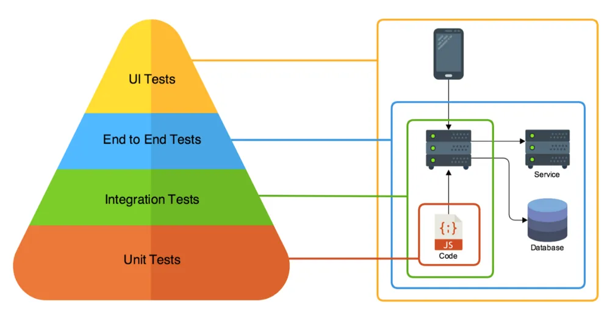

# Testing

## Pyramid of testing


### Unit test
Unit test adalah sebuah proses berupa program (code test secara autonomous testing) untuk memverifikasi method/function, class, atau widget yang berada di dalam aplikasi apakah sesuai dengan persyaratan atau design yang sudah dirancang sebelumnya. Pada tahapan ini memungkinkan seorang programmer untuk memastikan kualitas aplikasi dengan membuat code testing untuk menguji dan memastikan setiap komponen — komponen terkecil dari aplikasi secara disiplin dan pada jangka waktu yang cepat.

### Integration test
pengertiannya sama dengan unit test akan tetapi dalam tahap ini programmer memastikan pada sejumlah class yang berkerja sama apakah memiliki behavior yang benar. Berbeda dengan unit test yang bisa dijalankan kapan saja, intergration test ini hanya bisa dijalankan pada saat codingan yang sudah di-merge dari fitur branch ke master atau bisa dijalankan pada saat rilis aplikasi. Hal ini dikarenakan untuk menjalankan satu intergration test membutuhkan waktu yang lebih lama sesuai dengan seberapa besarnya sistem aplikasi, biasanya dilakukan antara 30 menit sampai 3 jam.


 ### End-to-end Testing / UI Testing
 End to end test adalah pengujian yang dilakukan dari ujung ke ujung yang berfokus pada hasil dari setiap interaksi pada fitur apllikasi (tamplian/output) namun dapat dilakukan dengan otomatisasi menggunakan software khusus seperti katalon studio atau silenium, dll.


 # TDD (Test Driven Development)
 Sebuah proses dalam melakukan testing
 ## The Mantra of TDD

 ### Red (Write a test that fail)
 Dimulai dengan bikin testing terlebih dahulu, belom ada fiturnya, otomatis pasti fail

 ### Green (Make the code work)
 Bikin featurenya sampe testingnya itu sampai berhasil

 ### Refactor (Eliminate Redudancy)
 Percantik codingan kalian sehingga lebih efisien dan dinamis


# Demo
 ## Jest
 Jest itu merupakan Testrunner & Assertion 
 - Testrunner = library buat ngejalanin test
 - Assertion = buat nguji result sesuai ekspetasi

 [Dokumentasi Jest](https://jestjs.io/docs/getting-started)

### Test Definition
Mendefine sebuah test menggunakan test/it
```js
// 1 test = 1 unit test'
// bisa pake test / it
// 1 unit test => ada ekspetasi
// 1 ekspetasi => ada hasil(matchers)
// toBe => disebut matchers

const sum = (a, b) => {
    return a + b
}

const multiply = (a, b) => {
    return a * b
}

test('adds 1 + 2 to equal 3', () => {
    expect(sum(1, 2)).toBe(3);
    expect(sum(3, 4)).toBe(7);
});


it('multiplies 2 * 3 to equal 6', () => {
    expect(multiply(2, 3)).toBe(6);
    expect(multiply(5, 10)).toBe(50);
});
```
[Dokumentasi Matchers](https://jestjs.io/docs/using-matchers)

### Describe
menggabukan beberapa test yg berhubungan agar lebih rapih gak berceceran

```js

describe('test function math', () => {
    test('adds 1 + 2 to equal 3', () => {
        expect(sum(1, 2)).toBe(3);
        expect(sum(3, 4)).toBe(7);
    });


    it('multiplies 2 * 3 to equal 6', () => {
        expect(multiply(2, 3)).toBe(6);
        expect(multiply(5, 10)).toBe(50);
    });
})

```
[Dokumentasi Describe](https://jestjs.io/docs/api#describename-fn)


### Skip & Only
- test/describe.skip = Untuk ngeskip suatu test/describe
- test/describe.only = Hanya jalanin test/describe ini

[Dokumentasi Skip](https://jestjs.io/docs/api#testskipname-fn) & [Dokumentasi Only](https://jestjs.io/docs/api#testonlyname-fn-timeout)

### Environment (config)
Environment yang kita gunakan adalah testing, database yang kita gunakan pun juga berbeda
setting config test untuk menyesuaikan database yang kita gunakan

### Database
Buat database & jalankan migrasi untuk database testing
```
npx sequelize db:create --env test
npx sequelize db:migrate --env test
```

### Supertest
karena kita ngetestnya sebuah aplikasi, yang dimana harus dijalanin dulu, dan juga per endpointnya tidak ngereturn sesuatu kayak contoh diatas, kita perlu bantuan suatu library yaitu supertest

Supertest adalah http assertion yang berguna untuk testing http method
(seperti axios, tapi dalam dunia testing)

[Dokumentasi Supertest](https://www.npmjs.com/package/supertest?activeTab=readme)

### Setting package.json
karena pada saat dijalankan jestnya nyangkut karena ada operasi asynchronus yg tidak di stop, maka kita harus nambahin suatu settingan
Setting properti test dalam script dengan 
```
"test" : jest --detectOpenHandles --forceExit
```
- --detectOpenHandles = untuk ngedetect operasi asynchronus
- --forceExit = untuk ngeforce jestnya supaya berhenti


### Lifecyle testing
bisa dimanfaatkan untuk menjalankan suatu code sebelum / sesudah proses testing berjalan, ex : seeding
- afterAll
- afterEach
- beforeAll
- beforeEach

[Dokumentasi lifecyle testing](https://jestjs.io/docs/api#afterallfn-timeout)


### Bin www
buatlah sebuah folder bin berisi file bernama www, dan diisi dengan app.listen agar setiap kita mau jalanin testing gausah di comment
[Dokumentasi struktur express](https://expressjs.com/en/starter/generator.html)


